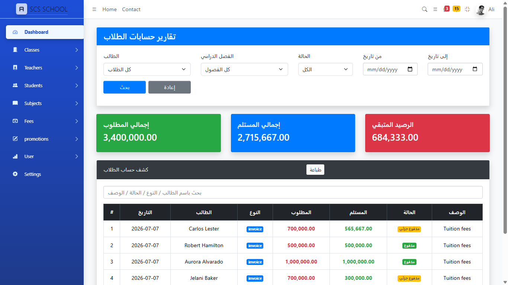

# 🎓 School Management System

A modern School Management System built with **Laravel** to simplify the management of schools, students, teachers, classes, attendance, fees, and academic records through an intuitive web interface.

---

## 📖 Overview

The system is designed to help educational institutions manage daily operations efficiently by providing centralized access to student information, financial records, and academic activities.

---

## ✨ Features

- 👨‍🎓 Student Management
- 👨‍🏫 Teacher Management
- 🏫 Classroom & Grade Management
- 📚 Subject Management
- 💰 Tuition Fee Management
- 🧾 Student Invoices
- 💳 Student Payments
- 📊 Financial Reports
- 📈 Dashboard & Statistics
- 👤 User Authentication
- 🔐 Role & Permission Management
- 📄 Printable Reports
- 🌐 Responsive Design

---

## 🛠️ Built With

- Laravel
- PHP 8+
- MySQL
- Bootstrap
- JavaScript
- HTML5
- CSS3

---

## 📷 Screenshots

 ## ⚙️ Installation

Clone the repository

```bash
git clone https://github.com/Ana090/School-Management-System.git
```

Move to the project directory

```bash
cd School-Management-System
```

Install dependencies

```bash
composer install
```

Install Node packages

```bash
npm install
```

Copy environment file

```bash
cp .env.example .env
```

Generate application key

```bash
php artisan key:generate
```

Configure your database in `.env`

Run migrations

```bash
php artisan migrate
```

Start the server

```bash
php artisan serve
```

---

## 📂 Project Structure

```
app/
bootstrap/
config/
database/
public/
resources/
routes/
storage/
tests/
```

---

## 🔐 Default Credentials

Create your own administrator account or use database seeders if available.

---

## 📌 Future Improvements

- Online Exams
- SMS Notifications
- Email Notifications
- Parent Portal
- Mobile Application
- QR Code Attendance
- API Integration

---

## 🤝 Contributing

Contributions are welcome.

1. Fork the repository
2. Create your feature branch
3. Commit your changes
4. Push to the branch
5. Open a Pull Request

---

## 📄 License

This project is licensed under the MIT License.

---

## 👨‍💻 Developer

**Anas Mohamed Adam**

- Information Systems Graduate
- Full Stack Laravel Developer
- Sudan

GitHub:
https://github.com/Ana090

Email:
anasinformation.sd@gmail.com

---

⭐ If you like this project, don't forget to give it a star.
